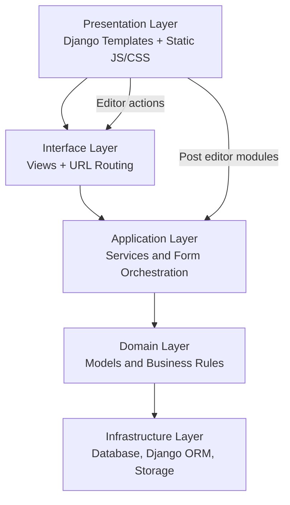

| TEST |  |
| --- | --- |
| COVERAGE |  |

---

# Model Blog Platform

This project is a content platform built with Django to publish blog posts, manage authors/readers, and optimize content delivery with SEO-focused pages.

The current project baseline includes:
- Django application with layered refactoring in progress
- Post editor with rich content features (including YouTube support)
- Authentication: email/username login, dynamic credential recovery, Google Sign-In (GIS + django-allauth)
- Test automation with Pytest + coverage gate
- Formatting and quality checks with pre-commit

---

## Tech Stack

- Python / Django
- django-allauth (Google OAuth)
- SQLite
- JavaScript
- Docker + Poetry
- Pytest + Coverage
- pre-commit (ruff, black, isort)

---

## Current Highlights

- Refactored author and reader profile editing into service-oriented flows
- **Authentication:** login with email or username, dynamic «forgot email/username» recovery, Google Sign-In via GIS + allauth
- **Author onboarding:** new Google users are Readers; becoming an Author requires Django superuser approval (sign-up or `/solicitar-autor/`)
- **Author and reader edit pages** share reusable form partials (`website/templates/components/forms/`) and a common CSS layer (`website/static/css/shared/edit-profile.css`); author-specific formsets (social, jobs, graduation) live in `website/static/css/author/edit-formsets.css`
- Improved post editor modules (`website/static/scripts/editor`) with media and YouTube embedding
- Organized static assets by domain (`css/shared`, `css/author`, `css/reader`, `css/post`, `css/user`, etc.)
- CI-ready test suite with required coverage threshold

---

## Authentication

| Flow | URL | Notes |
|------|-----|-------|
| Login (email/username + password) | `/login/` | Dynamic recovery when account not found |
| Sign up | `/cadastre-se/` | Reader by default; Author requires admin approval |
| Google Sign-In | GIS button on login/sign-up | OAuth via allauth; new users → Reader |
| Request Author profile | `/solicitar-autor/` | Logged-in Reader; superuser approval required |

**Environment variables** (see `.env.example`):

```bash
GOOGLE_OAUTH_CLIENT_ID=....apps.googleusercontent.com
GOOGLE_OAUTH_CLIENT_SECRET=GOCSPX-...
DJANGO_SITE_DOMAIN=localhost:8000   # dev
```

**Google Cloud Console** (OAuth 2.0 Web client):

Copy `.env.example` to `.env` and fill in secrets before testing Google login locally.

---

## Profile Edit Pages (Author & Reader)

These pages were historically the hardest to maintain; they now follow a consistent structure:

| Page | Template | CSS entrypoint | Forms |
|------|----------|----------------|-------|
| Author | `website/templates/blog/pages/edit-author/edit-author.html` | `css/author/edit.css` | Account + author profile + inline formsets (social, jobs, graduation) |
| Reader | `website/templates/blog/pages/edit-reader/edit-reader.html` | `css/reader/edit.css` | Account + reader profile (name, photo) |

Shared building blocks:

- **Templates:** `form_table.html`, `form_field_row.html`, `formset_section.html`, `formset_item.html`
- **CSS:** `shared/edit-profile.css` (layout, inputs, selects, textarea, responsive breakpoints)
- **Author-only CSS:** `author/edit-formsets.css` (formset layout, checkboxes, add buttons)
- **JS:** `formset-dynamic.js` and `author-edit-formsets.js` for dynamic inline formsets on the author page

For CSS organization details, see `website/static/css/README.md`.

---

## Architecture Overview (Clean-Layered View)



---

## Project Structure

You can regenerate the `tree.txt` file with:

```bash
./generate_tree.sh
```

---

## Local Setup and Validation

### Run with Docker container

Set `UID` and `GID` in `.env` to match your host user (`id -u` / `id -g`). The compose file runs the app as that user so bind-mounted files are not owned by root.

On `docker compose up`, the entrypoint runs `poetry install` into the bind-mounted `.venv` (no duplicate install during image build).

```bash
docker compose down
docker compose up -d --build
docker compose logs -f python-app   # wait for "Installing Poetry dependencies..."
docker compose exec python-app poetry run python manage.py migrate
docker compose exec python-app poetry run python manage.py runserver 0.0.0.0:8000
```

If files were previously created as root inside the container, fix ownership once on the host:

```bash
sudo chown -R "$(id -u):$(id -g)" .
```

### Run tests and coverage

```bash
docker compose exec python-app poetry run pytest website/tests/
```

On the host (with Poetry venv):

```bash
export DJANGO_SECRET_KEY='your-secret-key-with-at-least-fifty-characters-long'
export DJANGO_DEBUG=True
poetry run python manage.py test website/tests/
```

### Run pre-commit checks

On the host (recommended) or inside the container (same UID as host when `user:` is set):

```bash
pre-commit run --all-files
# or
docker compose exec python-app poetry run pre-commit run --all-files
```

---

## Project History

The following milestones are intentionally preserved to keep historical context:

- Project Initiated
- Made Header and Menu functionality
- Made Our Team Page
- Made card profile which is used in Author Page and Our Team Page
- Made author edit profile with inline formsets (social media, jobs, graduation) and shared form/CSS components
- Made edit social media profile functionality with messages return
- Rewrite the user custom model which has been used to create author and reader profiles
- Made login page with email/username, dynamic recovery, and Google Sign-In (django-allauth + GIS)
- Author sign-up and Reader→Author upgrade require Django superuser approval
- Made Sign Up page with reader and author type register
- Made reader edit profile reusing the same edit-profile CSS and form partials as the author page
- Made Password validation with JavaScript
- Setting show hide password on Login Page
- Made Password validation in a view Django
- Made test to check if view password validation works

---

## Check Password Screenshot

|  |  |
| --- | --- |
|  |  |

---

## Password Validation Notes

### Front-end password check

This functionality checks if the password contains upper-case character, number, special character, and length between 10 and 16 characters.
Beyond that, the finish register button is activated only if these requirements are met and the first password and confirmation are the same.
However, this does not prevent a malicious user from modifying logic through DevTools and submitting an unsafe password.

### Backend password check

To prevent unsafe requests, passwords are also validated in Django views before persisting users.
The related flow is covered by tests.

---
