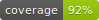
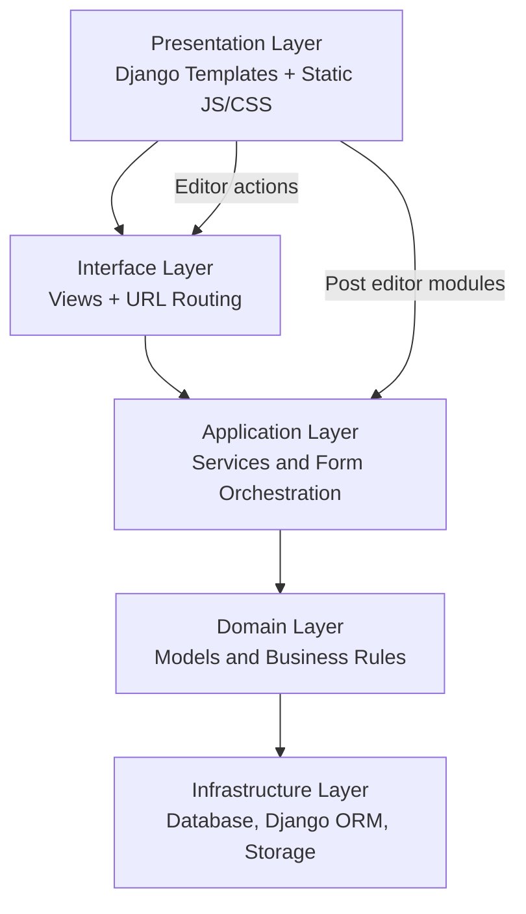

| TEST |  |
| --- | --- |
| COVERAGE |  |

---

# Model Blog Platform

This project is a content platform built with Django to publish blog posts, manage authors/readers, and optimize content delivery with SEO-focused pages.

The current project baseline includes:
- Django application with layered refactoring in progress
- Post editor with rich content features (including YouTube support)
- Test automation with Pytest + coverage gate
- Formatting and quality checks with pre-commit

---

## Tech Stack

- Python / Django
- SQLite
- JavaScript
- Docker + Poetry
- Pytest + Coverage
- pre-commit (ruff, black, isort)

---

## Current Highlights

- Refactored author and reader profile editing into service-oriented flows
- Improved post editor modules (`website/static/scripts/editor`) with media and YouTube embedding
- Organized static assets by domain (`css/author`, `css/reader`, `css/post`, `css/user`, etc.)
- CI-ready test suite with required coverage threshold

---

## Architecture Overview (Clean-Layered View)



---

## Project Structure

The complete and updated project tree is documented in `tree.txt`.

You can regenerate it with:

```bash
./generate_tree.sh
```

---

## Local Setup and Validation

### Run with Docker container

```bash
docker compose up -d
docker exec -it python_app bash
cd /app
poetry run python manage.py migrate
poetry run python manage.py runserver 0.0.0.0:8000
```

### Run tests and coverage

```bash
docker exec -it python_app bash
cd /app
poetry run pytest website/tests/
```

### Run pre-commit checks (host environment)

```bash
pre-commit run --all-files
```

---

## Project History

The following milestones are intentionally preserved to keep historical context:

- Project Initiated
- Made Header and Menu functionality
- Made Our Team Page
- Made card profile which is used in Author Page and Our Team Page
- Made author edit profile (needs more functionality later)
- Made edit social media profile functionality with messages return
- Rewrite the user custom model which has been used to create author and reader profiles
- Made Sign Up page with reader and author type register
- Made Reader edit profile (more simple than author)
- Made login page
- Made Password validation with JavaScript
- Setting show hide password on Login Page
- Made Password validation in a view Django
- Made test to check if view password validation works

---

## Check Password Screenshot

|  |  |
| --- | --- |
|  |  |

---

## Password Validation Notes

### Front-end password check

This functionality checks if the password contains upper-case character, number, special character, and length between 10 and 16 characters.
Beyond that, the finish register button is activated only if these requirements are met and the first password and confirmation are the same.
However, this does not prevent a malicious user from modifying logic through DevTools and submitting an unsafe password.

### Backend password check

To prevent unsafe requests, passwords are also validated in Django views before persisting users.
The related flow is covered by tests.

---
